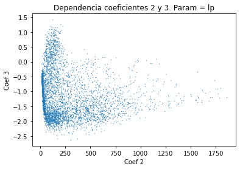
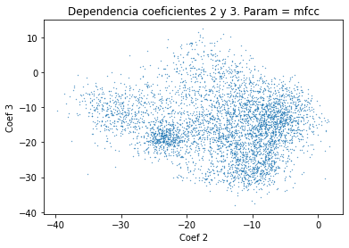
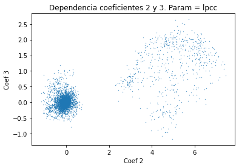

PAV - P4: reconocimiento y verificación del locutor
===================================================

Obtenga su copia del repositorio de la práctica accediendo a [Práctica 4](https://github.com/albino-pav/P4)
y pulsando sobre el botón `Fork` situado en la esquina superior derecha. A continuación, siga las
instrucciones de la [Práctica 2](https://github.com/albino-pav/P2) para crear una rama con el apellido de
los integrantes del grupo de prácticas, dar de alta al resto de integrantes como colaboradores del proyecto
y crear la copias locales del repositorio.

También debe descomprimir, en el directorio `PAV/P4`, el fichero [db_8mu.tgz](https://atenea.upc.edu/pluginfile.php/3145524/mod_assign/introattachment/0/spk_8mu.tgz?forcedownload=1)
con la base de datos oral que se utilizará en la parte experimental de la práctica.

Como entrega deberá realizar un *pull request* con el contenido de su copia del repositorio. Recuerde
que los ficheros entregados deberán estar en condiciones de ser ejecutados con sólo ejecutar:

~~~~~~~~~~~~~~~~~~~~~~~~~~~~~~~~~~~~~~~~~~~~~~~~~~~~~.sh
  make release
  run_spkid mfcc train test classerr verify verifyerr
~~~~~~~~~~~~~~~~~~~~~~~~~~~~~~~~~~~~~~~~~~~~~~~~~~~~~

Recuerde que, además de los trabajos indicados en esta parte básica, también deberá realizar un proyecto
de ampliación, del cual deberá subir una memoria explicativa a Atenea y los ficheros correspondientes al
repositorio de la práctica.

A modo de memoria de la parte básica, complete, en este mismo documento y usando el formato *markdown*, los
ejercicios indicados.

## Ejercicios.

### SPTK, Sox y los scripts de extracción de características.

- Analice el script `wav2lp.sh` y explique la misión de los distintos comandos involucrados en el *pipeline*
  principal (`sox`, `$X2X`, `$FRAME`, `$WINDOW` y `$LPC`). Explique el significado de cada una de las 
  opciones empleadas y de sus valores.
  
  **El programa sox nos permite generar una señal con el formato adecuado a partir de otro formato. En nuestro programa el formato de entrada, identificado con el comando '-t' es raw (crudo). '-e' conforma la codificación en un formato 'signed' con '-b' dieciséis bits.**
  
  **El comando de SPTK x2x nos permite convertir datos de una entrada estandard a otro tipo de datos diferente. En nuestra línea de comando, convertimos short (2 bytes) a float (4 bytes) con la orden '+sf'.**
  
  **Frame extrae una trama de una secuencia de datos. de longitud '-l' y período '-p'.**
  
  **Window enventana una señal. La longitud de datos de entrada es la de la trama '-l' y el resultado del enventanado tiene una longitud '-L'.**
  
  **LPC calcula los coeficientes de predicción lineal de la trama de longitud '-l' y el orden de los coeficientes lo determinamos con '-m'.** 
  

- Explique el procedimiento seguido para obtener un fichero de formato *fmatrix* a partir de los ficheros de
  salida de SPTK (líneas 45 a 47 del script `wav2lp.sh`).

  * ¿Por qué es conveniente usar este formato (u otro parecido)? Tenga en cuenta cuál es el formato de
    entrada y cuál es el de resultado.

- Escriba el *pipeline* principal usado para calcular los coeficientes cepstrales de predicción lineal
  (LPCC) en su fichero <code>scripts/wav2lpcc.sh</code>:
  
  ~~~~~~~~~~~~~~~~~~~~~~~~~~~~~~~~~~~~~~~~~~~~~~~~~~~~~.sh
  sox $inputfile -t raw -e signed -b 16 - | $X2X +sf | $FRAME -l 240 -p 80 | $WINDOW -l 240 -L 240 | $LPC -l 240 -m $lpc_order |
	$LPCC -m $lpc_order -M $cepstrum_order > $base.lpcc
  ~~~~~~~~~~~~~~~~~~~~~~~~~~~~~~~~~~~~~~~~~~~~~~~~~~~~~

- Escriba el *pipeline* principal usado para calcular los coeficientes cepstrales en escala Mel (MFCC) en su
  fichero <code>scripts/wav2mfcc.sh</code>:
  
  ~~~~~~~~~~~~~~~~~~~~~~~~~~~~~~~~~~~~~~~~~~~~~~~~~~~~~.sh
  sox $inputfile -t raw -e signed -b 16 - | $X2X +sf | $FRAME -l 240 -p 80 | $WINDOW -l 240 -L 240 |
	$MFCC -l 240 -m $mfcc_order -s $sampling_frequency -n $channel_order > $base.mfcc
  ~~~~~~~~~~~~~~~~~~~~~~~~~~~~~~~~~~~~~~~~~~~~~~~~~~~~~

### Extracción de características.

- Inserte una imagen mostrando la dependencia entre los coeficientes 2 y 3 de las tres parametrizaciones
  para todas las señales de un locutor.
  

  
  
    
  

  + Indique **todas** las órdenes necesarias para obtener las gráficas a partir de las señales 
    parametrizadas.
    
  **Usando un código de python hemos podido obtener las gráficas que relacionan los coeficientes 2 y 3 de cada una de las parametrizaciones.**
  
  **Usamos el siguiente comando para obtener los datos**
  ~~~~~~~~~~~~~~~~~~~~~~~~~~~~~~~~~~~~~~~~~~~~~~~~~~~~~.sh
  fmatrix_show work/lp/BLOCK01/SES017/*.lp | egrep '^\[' | cut -f2,3 > lp_2_3.txt
  ~~~~~~~~~~~~~~~~~~~~~~~~~~~~~~~~~~~~~~~~~~~~~~~~~~~~~
  **Cambiamos 'lp' por la parametrización que queremos analizar (MFCC o LPCC).**
  ```python
  
  f = open('lp_2_3.txt', "r")
  leer_lineas = f.read()
  fil=[]
  col=[]
  x=""
  y=""
  tab = False
  for i in leer_lineas:
    if i != '\t' and tab == False:
      x = x+i
    
    elif i == '\t':
      fil.append(float(x))
      tab = True

    if tab == True and i != '\t' and i!='\n':
      y = y + i
    elif i == '\n':
      col.append(float(y))
      x=""
      y=""
      tab = False
    
  plt.scatter(fil,col,s = 0.1)
  plt.title('Dependencia coeficientes 2 y 3. Param = lp')
  plt.xlabel('Coef 2')
  plt.ylabel('Coef 3')
  plt.show()
 
  ```
  
  
  + ¿Cuál de ellas le parece que contiene más información?

- Usando el programa <code>pearson</code>, obtenga los coeficientes de correlación normalizada entre los
  parámetros 2 y 3 para un locutor, y rellene la tabla siguiente con los valores obtenidos.

  |                        |    LP    |   LPCC   |     MFCC   |
  |------------------------|:--------:|:--------:|:----------:|
  | &rho;<sub>x</sub>[2,3] | -0.87228 | 0.769145 | -0.146628  |
  
  + Compare los resultados de <code>pearson</code> con los obtenidos gráficamente.
  
  **Mediante otro script de python obtenemos el valor del parámetro de pearson a partir de los datos que constituyen los gráficos.**
  
  |    De nuestros datos   |    LP    |   LPCC   |     MFCC   |
  |------------------------|:--------:|:--------:|:----------:|
  | &rho;<sub>x</sub>[2,3] | -0.18018 |  0.76197 |  -0.13334  |
  
- Según la teoría, ¿qué parámetros considera adecuados para el cálculo de los coeficientes LPCC y MFCC?
  
  **Para la parametrización MFCC, el orden de los coeficientes es suficiente que sea 13 ya que a partir de ahí la mejora no es significativa y se usan entre 24 y 40 bandas de frecuencia. Para los coeficientes LPCC, es común usar a partir de 12 coeficientes.**

### Entrenamiento y visualización de los GMM.

Complete el código necesario para entrenar modelos GMM.

- Inserte una gráfica que muestre la función de densidad de probabilidad modelada por el GMM de un locutor
  para sus dos primeros coeficientes de MFCC.
  
- Inserte una gráfica que permita comparar los modelos y poblaciones de dos locutores distintos (la gŕafica
  de la página 20 del enunciado puede servirle de referencia del resultado deseado). Analice la capacidad
  del modelado GMM para diferenciar las señales de uno y otro.

### Reconocimiento del locutor.

Complete el código necesario para realizar reconociminto del locutor y optimice sus parámetros.

- Inserte una tabla con la tasa de error obtenida en el reconocimiento de los locutores de la base de datos
  SPEECON usando su mejor sistema de reconocimiento para los parámetros LP, LPCC y MFCC.

### Verificación del locutor.

Complete el código necesario para realizar verificación del locutor y optimice sus parámetros.

- Inserte una tabla con el *score* obtenido con su mejor sistema de verificación del locutor en la tarea
  de verificación de SPEECON. La tabla debe incluir el umbral óptimo, el número de falsas alarmas y de
  pérdidas, y el score obtenido usando la parametrización que mejor resultado le hubiera dado en la tarea
  de reconocimiento.
 
### Test final

- Adjunte, en el repositorio de la práctica, los ficheros `class_test.log` y `verif_test.log` 
  correspondientes a la evaluación *ciega* final.

### Trabajo de ampliación.

- Recuerde enviar a Atenea un fichero en formato zip o tgz con la memoria (en formato PDF) con el trabajo 
  realizado como ampliación, así como los ficheros `class_ampl.log` y/o `verif_ampl.log`, obtenidos como 
  resultado del mismo.
